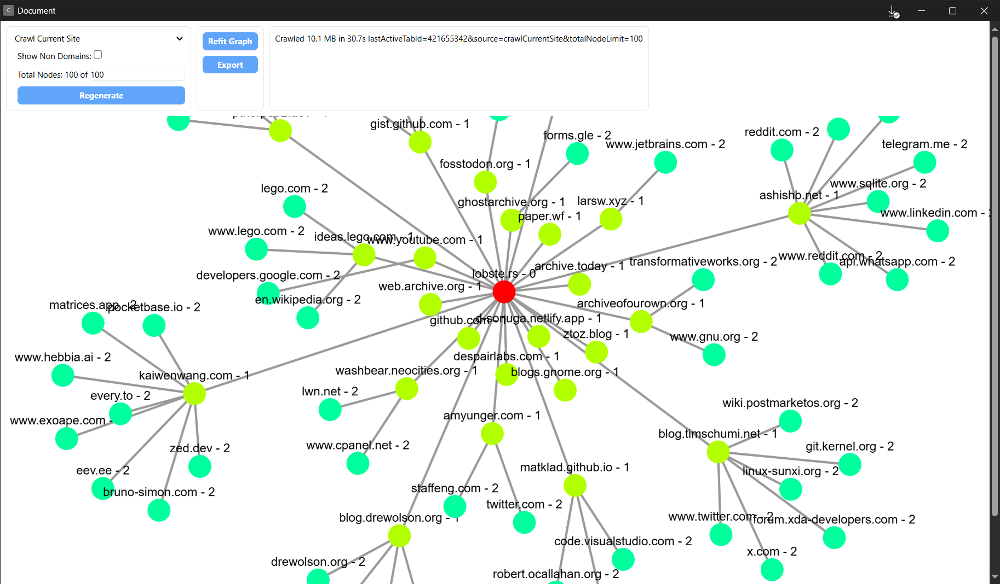
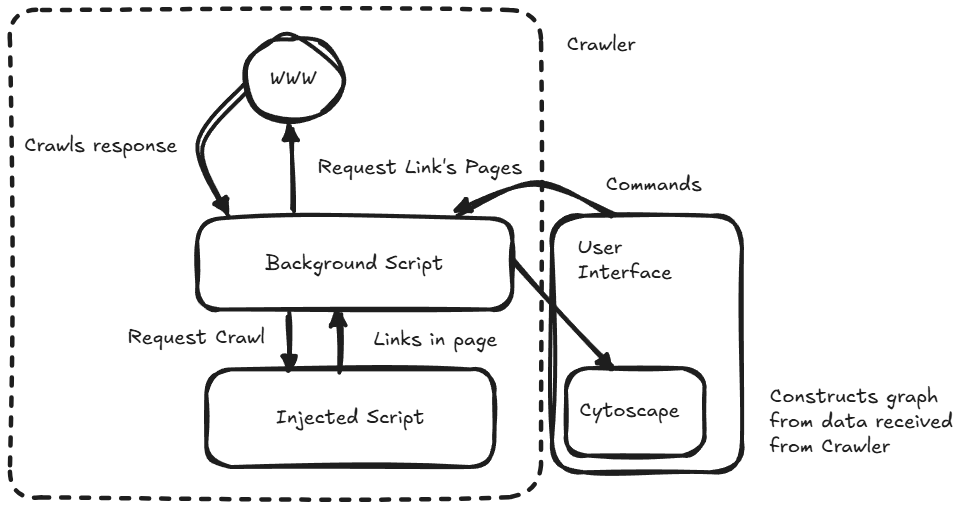

# 🦀 Crawly
A web crawler in your browser, This is an extension that when run on a websites, crawls all the links from the page and crawls the links, creating a graph

This is mainly for fun and if you want to answer the question how interconnected is the web really?, Could also be used for site discovery 

## INSTALLATION & USAGE
Currently I haven't figured out how to package this in a way I am happy with, but if really want to try it before I do that,
Get [bun](https://bun.sh/) and run `bun run build.ts` and then open a Chromium browser (Still have to test with FF) and in extension dev mode,
load this folder

## ARCH
Currently uses Bun as it's build system but everything is in typescript so it should be fine, Code is pretty 🍝 though

## TODO
1. Map domains
2. Work on mapping links
3. Work off user history & procedurally add nodes to graphs
4. Find where servers are and draw them on a globe
5. Group up big company services to prevent them from infesting the graph, as in Google, Microsoft, Amazon etc.